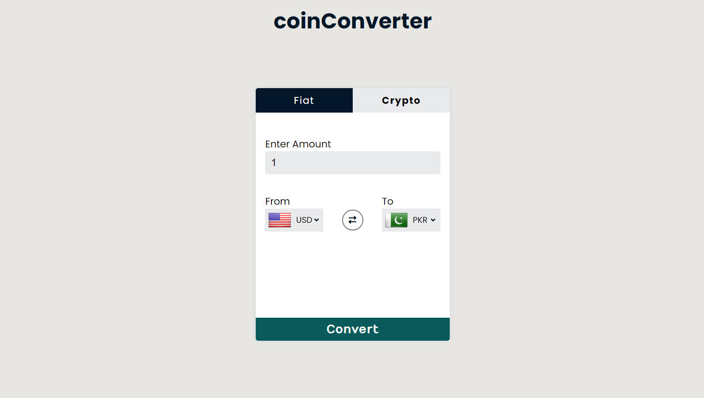

# coinConverter Website

Welcome to the coinConverter website repository! This web application allows users to seamlessly convert between different fiat currencies. Although the crypto conversion feature is currently under development, the future plans include enabling conversion between cryptocurrencies and fiat currencies, ensuring a comprehensive financial toolkit for users.

## Preview

<a href="https://codebyfaisal.github.io/project1" target="_blank">Project Preview</a>

## Features

### Fiat Section

- **Conversion Interface:** Easily convert between different fiat currencies with a user-friendly design.
- **Error Handling:** A robust error-handling system displays messages for invalid or non-numeric inputs.
- **Responsive Design:** The website is responsive across various devices, providing a consistent experience.
- **Light Theme:** A clean and cool light theme enhances visibility and readability.

### Crypto Section (Future Development)

- **Upcoming Feature:** The crypto conversion section is currently in development and will be added in future updates.
- **Expanded Functionality:** Users will have the ability to convert between cryptocurrencies and fiat currencies.

## Technologies Used

- HTML
- CSS
- JavaScript

## How to Use

1. Clone this repository.
2. Open the `index.html` file in your preferred web browser.
3. Explore the different fiat currency conversion options.

## Future Improvements

The following enhancements are planned for future updates:

- **Crypto Conversion:** Implement the crypto section for converting between different cryptocurrencies and fiat currencies.
- **JavaScript Interactivity:** Enhance interactivity using JavaScript to create a more dynamic user experience.
- **Multi-theme Support:** Introduce dark and additional themes for user customization.
- **Further Responsiveness:** Ensure optimal performance and responsiveness across a wide range of devices.

## Contributions

Feel free to contribute to this project by submitting pull requests or providing feedback. If you have any questions or suggestions, please reach out.

Happy Coding! 🚀
